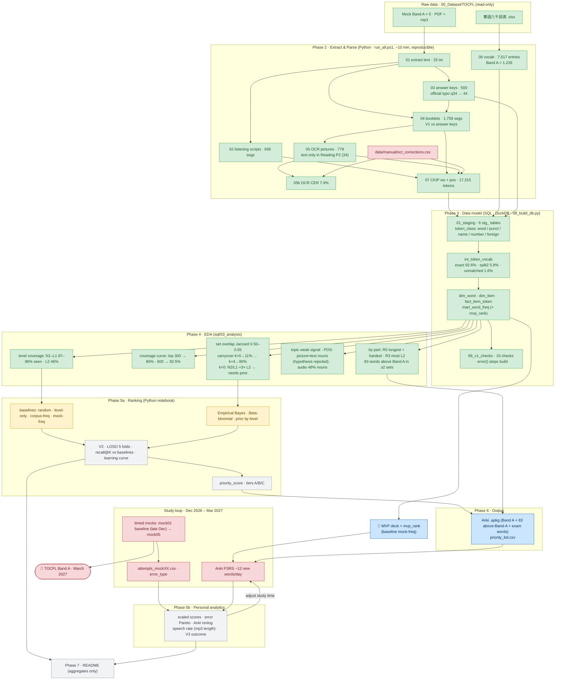

# Workflow

Status: ✅ done · 🔄 next · ⬜ to do — updated 2026-11-28

```mermaid
flowchart TD
    classDef done fill:#d4edda,stroke:#28a745,color:#155724
    classDef wip fill:#fff3cd,stroke:#d39e00,color:#5c4400
    classDef todo fill:#f1f3f5,stroke:#868e96,color:#343a40
    classDef manual fill:#f8d7da,stroke:#c82333,color:#721c24
    classDef out fill:#cce5ff,stroke:#0062cc,color:#003166

    subgraph RAW["Raw data · 00_Dataset/TOCFL (read-only)"]
        R1["Mock Band A × 5 · PDF + mp3"]:::done
        R2["華語八千詞表 .xlsx"]:::done
    end

    subgraph P2["Phase 2 · Extract & Parse (Python · run_all.ps1, ~10 min, reproducible)"]
        S1["01 extract text · 25 txt"]:::done
        S2["02 listening scripts · 936 segs"]:::done
        S3["03 answer keys · 500<br/>official typo q34 → 44"]:::done
        S4["04 booklets · 1,759 segs<br/>V1 vs answer keys"]:::done
        S5["05 OCR pictures · 778<br/>text only in Reading P2 (34)"]:::done
        M1["data/manual/ocr_corrections.csv"]:::manual
        S5b["05b OCR CER 7.9%"]:::done
        S6["06 vocab · 7,517 entries<br/>Band A = 1,226"]:::done
        S7["07 CKIP ws + pos · 17,315 tokens"]:::done
    end

    subgraph P3["Phase 3 · Data model (SQL · DuckDB · 08_build_db.py)"]
        D1["01_staging · 6 stg_ tables<br/>token_class: word / punct / name / number / foreign"]:::done
        D2["int_token_vocab<br/>exact 92.6% · split2 5.8% · unmatched 1.6%"]:::done
        D3["dim_word · dim_item · fact_item_token<br/>mart_word_freq (+ mvp_rank)"]:::done
        D4["99_v1_checks · 10 checks · error() stops build"]:::done
    end

    MVP["🎯 MVP deck = mvp_rank<br/>(baseline mock-freq)"]:::out

    subgraph P4["Phase 4 · EDA (sql/03_analysis)"]
        E1["level coverage: N1–L1 87–96% seen · L2 46%"]:::done
        E2["coverage curve: top 300 → 80% · 600 → 92.5%"]:::done
        E3["by part: R5 longest + hardest · R3 most L2<br/>83 words above Band A in ≥2 sets"]:::done
        E4["topic weak signal · POS: picture≈text nouns<br/>(hypothesis rejected) · audio 48% nouns"]:::done
        E5["set overlap Jaccard 0.50–0.55<br/>carryover k=0→11% … k=4→90%<br/>k=0: N2/L1 ≈3× L2 → needs prior"]:::done
    end

    subgraph P5["Phase 5a · Ranking (Python notebook)"]
        F0["baselines: random · level-only · corpus-freq · mock-freq"]:::wip
        F1["Empirical Bayes · Beta-binomial · prior by level"]:::wip
        F2["V2 · LOSO 5 folds · recall@K vs baselines · learning curve"]:::todo
        F5["priority_score · tiers A/B/C"]:::todo
    end

    subgraph P6["Phase 6 · Output"]
        G1["Anki .apkg (Band A + 83 above-Band-A + exam words)<br/>priority_list.csv"]:::out
    end

    subgraph STUDY["Study loop · Dec 2026 – Mar 2027"]
        H1["Anki FSRS ~12 new words/day"]:::manual
        H2["timed mocks: mock01 baseline (late Dec) → mock05"]:::manual
        H3["attempts_mockXX.csv · error_type"]:::manual
    end

    subgraph P5B["Phase 5b · Personal analytics"]
        I1["scaled scores · error Pareto · Anki revlog<br/>speech rate (mp3 length) · V3 outcome"]:::todo
    end

    J1["Phase 7 · README (aggregates only)"]:::todo
    EXAM(["📝 TOCFL Band A · March 2027"]):::manual

    R1 --> S1
    S1 --> S2 & S3 & S4
    S3 --> S4 --> S5 --> S5b
    M1 --> S5b
    R2 --> S6
    S2 & S4 & S5 & M1 --> S7
    S7 & S6 & S3 --> D1 --> D2 --> D3 --> D4
    D3 --> MVP
    D3 --> E1 & E2 & E3 & E4 & E5
    E5 --> F1
    E1 --> F0
    F0 & F1 --> F2 --> F5 --> G1
    E3 --> G1
    MVP --> H1
    G1 --> H1
    H2 --> H3 --> I1
    H1 --> I1
    I1 -->|"adjust study time"| H1
    F2 & I1 --> J1
    H2 --> EXAM
```
