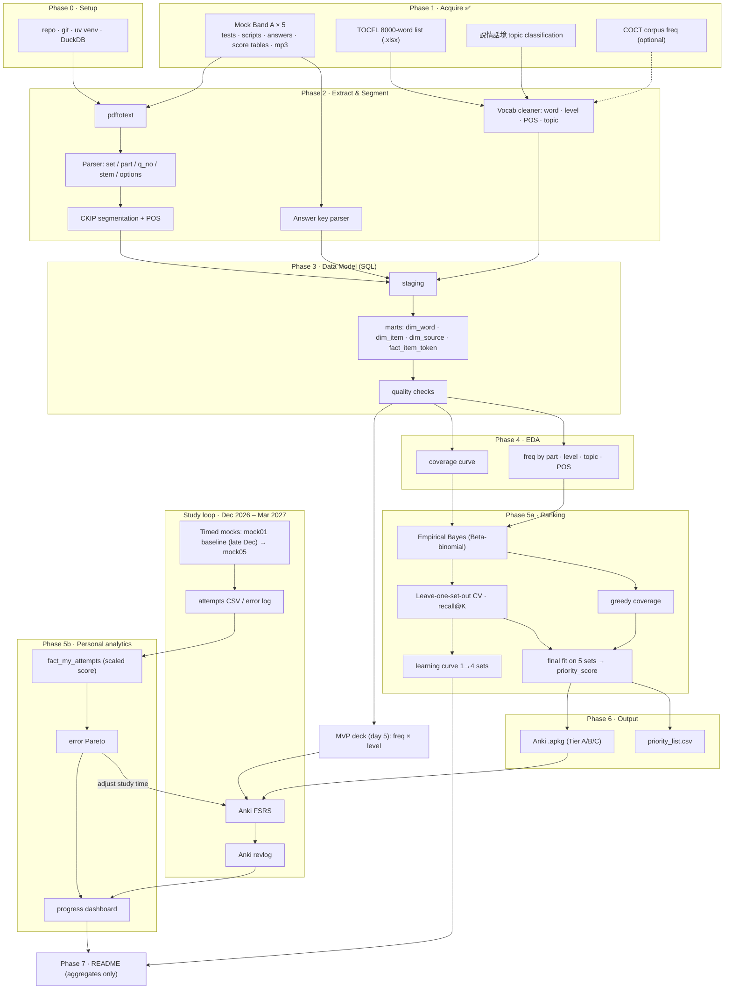

# Workflow

```mermaid
flowchart TD
    subgraph P1["Phase 1 · Acquire ✅"]
        A1["Mock Band A × 5<br/>tests · scripts · answers · score tables · mp3"]
        A2["TOCFL 8000-word list (.xlsx)"]
        A3["說情話境 topic classification"]
        A4["COCT corpus freq (optional)"]
    end
    subgraph P0["Phase 0 · Setup"]
        B1["repo · git · uv venv · DuckDB"]
    end
    subgraph P2["Phase 2 · Extract & Segment"]
        C1["pdftotext"] --> C2["Parser: set / part / q_no / stem / options"] --> C3["CKIP segmentation + POS"]
        C4["Answer key parser"]
        C5["Vocab cleaner: word · level · POS · topic"]
    end
    subgraph P3["Phase 3 · Data Model (SQL)"]
        D1["staging"] --> D2["marts: dim_word · dim_item · dim_source · fact_item_token"] --> D3["quality checks"]
    end
    MVP["MVP deck (day 5): freq × level"]
    subgraph P4["Phase 4 · EDA"]
        E1["coverage curve"]
        E2["freq by part · level · topic · POS"]
    end
    subgraph P5["Phase 5a · Ranking"]
        F1["Empirical Bayes (Beta-binomial)"] --> F2["Leave-one-set-out CV · recall@K"] --> F3["learning curve 1→4 sets"]
        F1 --> F4["greedy coverage"]
        F2 --> F5["final fit on 5 sets → priority_score"]
        F4 --> F5
    end
    subgraph P6["Phase 6 · Output"]
        G1["Anki .apkg (Tier A/B/C)"]
        G2["priority_list.csv"]
    end
    subgraph STUDY["Study loop · Dec 2026 – Mar 2027"]
        H1["Anki FSRS"] --> H4["Anki revlog"]
        H2["Timed mocks: mock01 baseline (late Dec) → mock05"] --> H3["attempts CSV / error log"]
    end
    subgraph P5B["Phase 5b · Personal analytics"]
        I1["fact_my_attempts (scaled score)"] --> I2["error Pareto"] --> I3["progress dashboard"]
    end
    J1["Phase 7 · README (aggregates only)"]

    A1 --> C1
    A1 --> C4
    A2 --> C5
    A3 --> C5
    A4 -.-> C5
    B1 --> C1
    C3 --> D1
    C4 --> D1
    C5 --> D1
    D3 --> MVP
    D3 --> E1 & E2
    E1 & E2 --> F1
    F5 --> G1 & G2
    MVP --> H1
    G1 --> H1
    H3 --> I1
    H4 --> I3
    I2 -->|"adjust study time"| H1
    I3 --> J1
    F3 --> J1
```
